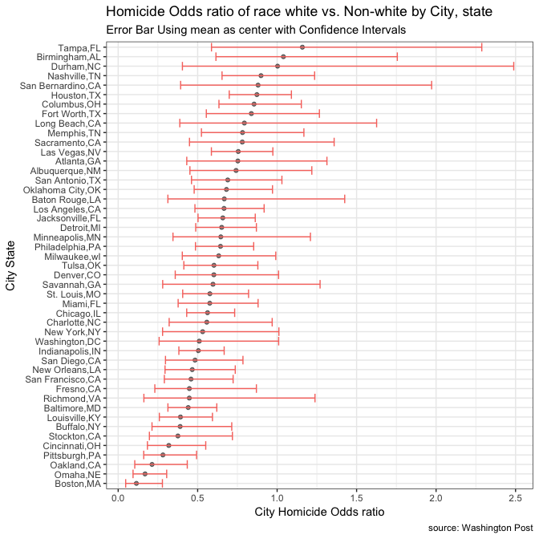

p8105\_hw6\_sj2921
================
Shan Jiang
11/16/2018

## problem 1

``` r
library(tidyverse)
```

    ## ── Attaching packages ──────────────────────────────────────────────────────────── tidyverse 1.2.1 ──

    ## ✔ ggplot2 3.0.0     ✔ purrr   0.2.5
    ## ✔ tibble  1.4.2     ✔ dplyr   0.7.6
    ## ✔ tidyr   0.8.1     ✔ stringr 1.3.1
    ## ✔ readr   1.1.1     ✔ forcats 0.3.0

    ## ── Conflicts ─────────────────────────────────────────────────────────────── tidyverse_conflicts() ──
    ## ✖ dplyr::filter() masks stats::filter()
    ## ✖ dplyr::lag()    masks stats::lag()

``` r
library(broom)
```

``` r
### Import the raw data.

homicide_raw = read_csv("https://raw.githubusercontent.com/washingtonpost/data-homicides/master/homicide-data.csv")
```

    ## Parsed with column specification:
    ## cols(
    ##   uid = col_character(),
    ##   reported_date = col_integer(),
    ##   victim_last = col_character(),
    ##   victim_first = col_character(),
    ##   victim_race = col_character(),
    ##   victim_age = col_character(),
    ##   victim_sex = col_character(),
    ##   city = col_character(),
    ##   state = col_character(),
    ##   lat = col_double(),
    ##   lon = col_double(),
    ##   disposition = col_character()
    ## )

### 1.1 Tidy the dataset

``` r
homicide_df = homicide_raw %>% 
  mutate(city_state = str_c(city, state, sep = "," )) %>% 
  mutate(case_status = as.numeric(disposition == "Closed by arrest")) %>% 
  filter(!city_state %in% c("Dallas,TX", "Phoenix,AZ","Kansas City,MO","Tulsa,AL" )) %>%
   ### relevel `victim_race`
  mutate(victim_race = 
           fct_relevel(ifelse(victim_race == "White", "white", "non-white"), "white")) %>% 
  ## change the victim_age as numeric
  mutate(victim_age = as.numeric(victim_age)) 
```

    ## Warning in evalq(as.numeric(victim_age), <environment>): NAs introduced by
    ## coercion

Since there are three levels for the factor of disposition, we need to
recode it as whether the homicide is solved or not: for *Closed by
arrest*, we coined it as 0 while adding 1 for “*Open/No arrest*” or
“*closed without arrest*”.

For categories white and non-white, with white as the reference
category.

### 1.2 Simulation

1)  Baltimore, MD Models For the city of Baltimore, MD, use the `glm`
    function to fit a logistic regression with resolved vs unresolved as
    the outcome and victim age, race(as just classified) and sex as
    predictors.

<!-- end list -->

``` r
Bal_logit = 
  homicide_df %>% 
  filter(city_state == "Baltimore,MD") %>% 
  glm(case_status ~ victim_age  + victim_sex + victim_race , data = ., family = binomial) 

## Obtain the estimate and confidence interval of the adjusted odds ratio for solving homicides comparing non-white victims to white victims keeping all other variables fixed.
Bal_logit %>% 
  broom::tidy() %>% 
  mutate(OR = exp(estimate)) %>%  ## sig.level = 0.05, critical value = 1.96
  mutate(CI.lower =  exp(estimate - std.error * 1.96)) %>% 
  mutate(CI.higher =  exp(estimate + std.error * 1.96)) %>%
  select(term, log_OR = estimate, OR, CI.lower, CI.higher, p.value) %>% 
  knitr::kable(digits = 3)
```

| term                  | log\_OR |    OR | CI.lower | CI.higher | p.value |
| :-------------------- | ------: | ----: | -------: | --------: | ------: |
| (Intercept)           |   1.186 | 3.274 |    2.067 |     5.186 |   0.000 |
| victim\_age           | \-0.007 | 0.993 |    0.987 |     0.999 |   0.032 |
| victim\_sexMale       | \-0.888 | 0.412 |    0.315 |     0.537 |   0.000 |
| victim\_racenon-white | \-0.820 | 0.441 |    0.313 |     0.620 |   0.000 |

*Comment*: the estimator of odds ratio is 0.441 \< 1 (95% CI: \[0.313,
0.620\]), implying that in Baltimore city, the odds of being murdered is
0.441 times lower among non-white citizens than white. Because the odds
ratio is under 1, which means being non-white can exert protective
effect for avoiding being murdered.

## Each city:Compare the white and non-white values

Do this within a “tidy” pipeline, making use of `purrr::map`, `list
columns`, and unnest as necessary to create a dataframe with estimated
ORs and CIs for each city.

``` r
## Create a list column for the city_state dataset

homicide_nest = homicide_df %>% 
  group_by(city_state) %>% 
  nest(victim_race:case_status)

head(homicide_nest)
```

    ## # A tibble: 6 x 2
    ##   city_state     data                
    ##   <chr>          <list>              
    ## 1 Albuquerque,NM <tibble [378 × 9]>  
    ## 2 Atlanta,GA     <tibble [973 × 9]>  
    ## 3 Baltimore,MD   <tibble [2,827 × 9]>
    ## 4 Baton Rouge,LA <tibble [424 × 9]>  
    ## 5 Birmingham,AL  <tibble [800 × 9]>  
    ## 6 Boston,MA      <tibble [614 × 9]>

``` r
## Create a glm function 
homicide_glm  = function(df) {
  glm = glm(case_status ~ victim_age + victim_race + victim_sex, data = df, family = binomial()) %>% 
  broom::tidy() 
  
  glm 
}


## Apply to each city, state 

city_murder =  homicide_nest %>% 
    mutate(models = map(homicide_nest$data, homicide_glm )) %>% 
    select(-data) %>% 
    unnest() 

## Add CI, city and tidy 
city_murder = city_murder %>%  
        mutate(OR = exp(estimate),
               log_OR = estimate) %>%
        filter(term == "victim_racenon-white") %>% 
        mutate(CI.low =  exp(estimate - std.error * 1.96) ) %>% 
        mutate(CI.high =  exp(estimate + std.error * 1.96)) %>% 
        select(city_state, term, log_OR, OR, p.value, CI.low, CI.high) %>% 
        mutate(city_state = fct_reorder(city_state, OR)) 
```

## Plot

Create a plot that shows the estimated ORs and CIs for each city.
Organize cities according to estimated OR, and comment on the plot.

``` r
city_murder %>% 
  ggplot(aes(x = city_state, y = OR)) + 
  geom_point(alpha = 0.52) +
  geom_errorbar(mapping = aes(ymin = CI.low, ymax = CI.high, colour = "darkred" )) +
  theme_classic() +
  theme(legend.position = "bottom",
        legend.direction = "horizontal",
        axis.text.x = element_text(angle = 90, size = 7)) + 
  coord_flip() + 
      labs(x = "State",
           y = "State Homicide Odds ratio", 
           title = "Homicide rates 2013-2015 by State", 
           subtitle = "Error Bar Using mean as center with Confidence Intervals", 
           caption = "source: Washington Post") + theme_bw()
```



## Problem 2

### Importation and cleaning the data

``` r
birth_weight = read_csv("./Data/birthweight.csv") 
```

    ## Parsed with column specification:
    ## cols(
    ##   .default = col_integer(),
    ##   gaweeks = col_double(),
    ##   ppbmi = col_double(),
    ##   smoken = col_double()
    ## )

    ## See spec(...) for full column specifications.

``` r
birth_weight = birth_weight %>% 
    mutate(babysex = as.factor(babysex)) %>% 
    mutate(bhead = as.numeric(bhead), 
            mrace = as.factor(mrace),
            frace = as.factor(frace) ,
            bwt = as.numeric(bwt)) %>% 
    mutate(mheight = as.numeric(mheight)) %>% 
    mutate(mheight = as.numeric(mheight)) 
```

There are `nrow(birth_weight)` observations and `ncol(birth_weight)`
variables in the dataset.

2.  Model procedure: stepwise elimination

a regression model for birthweight:
