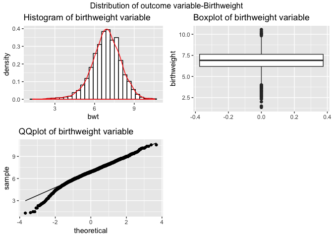

p8105\_hw6\_sj2921
================
Shan Jiang
11/16/2018

## problem 1

``` r
library(tidyverse)
```

    ## ── Attaching packages ──────────────────────────────────────────────────────── tidyverse 1.2.1 ──

    ## ✔ ggplot2 3.0.0     ✔ purrr   0.2.5
    ## ✔ tibble  1.4.2     ✔ dplyr   0.7.6
    ## ✔ tidyr   0.8.1     ✔ stringr 1.3.1
    ## ✔ readr   1.1.1     ✔ forcats 0.3.0

    ## ── Conflicts ─────────────────────────────────────────────────────────── tidyverse_conflicts() ──
    ## ✖ dplyr::filter() masks stats::filter()
    ## ✖ dplyr::lag()    masks stats::lag()

``` r
library(broom)
library(Hmisc)
```

    ## Loading required package: lattice

    ## Loading required package: survival

    ## Loading required package: Formula

    ## 
    ## Attaching package: 'Hmisc'

    ## The following objects are masked from 'package:dplyr':
    ## 
    ##     src, summarize

    ## The following objects are masked from 'package:base':
    ## 
    ##     format.pval, units

``` r
library(modelr)
```

    ## 
    ## Attaching package: 'modelr'

    ## The following object is masked from 'package:broom':
    ## 
    ##     bootstrap

``` r
library(mgcv)
```

    ## Loading required package: nlme

    ## 
    ## Attaching package: 'nlme'

    ## The following object is masked from 'package:dplyr':
    ## 
    ##     collapse

    ## This is mgcv 1.8-25. For overview type 'help("mgcv-package")'.

``` r
library(ggplot2)
```

``` r
### Import the raw data.

homicide_raw = read_csv("https://raw.githubusercontent.com/washingtonpost/data-homicides/master/homicide-data.csv")
```

    ## Parsed with column specification:
    ## cols(
    ##   uid = col_character(),
    ##   reported_date = col_integer(),
    ##   victim_last = col_character(),
    ##   victim_first = col_character(),
    ##   victim_race = col_character(),
    ##   victim_age = col_character(),
    ##   victim_sex = col_character(),
    ##   city = col_character(),
    ##   state = col_character(),
    ##   lat = col_double(),
    ##   lon = col_double(),
    ##   disposition = col_character()
    ## )

### 1.1 Tidy the dataset

``` r
homicide_df = homicide_raw %>% 
  mutate(city_state = str_c(city, state, sep = "," )) %>% 
  mutate(case_status = as.numeric(disposition == "Closed by arrest")) %>% 
  filter(!city_state %in% c("Dallas,TX", "Phoenix,AZ","Kansas City,MO","Tulsa,AL" )) %>%
   ### relevel `victim_race`
  mutate(victim_race = 
           fct_relevel(ifelse(victim_race == "White", "white", "non-white"), "white")) %>% 
  ## change the victim_age as numeric
  mutate(victim_age = as.numeric(victim_age)) 
```

    ## Warning in evalq(as.numeric(victim_age), <environment>): NAs introduced by
    ## coercion

Since there are three levels for the factor of disposition, we need to
recode it as whether the homicide is solved or not: for *Closed by
arrest*, we coined it as 0 while adding 1 for “*Open/No arrest*” or
“*closed without arrest*”.

For categories white and non-white, with white as the reference
category.

### 1.2 Simulation

1)  Baltimore, MD Models For the city of Baltimore, MD, use the `glm`
    function to fit a logistic regression with resolved vs unresolved as
    the outcome and victim age, race(as just classified) and sex as
    predictors.

<!-- end list -->

``` r
Bal_logit = 
  homicide_df %>% 
  filter(city_state == "Baltimore,MD") %>% 
  glm(case_status ~ victim_age  + victim_sex + victim_race , data = ., family = binomial) 

## Obtain the estimate and confidence interval of the adjusted odds ratio for solving homicides comparing non-white victims to white victims keeping all other variables fixed.
Bal_logit %>% 
  broom::tidy() %>% 
  mutate(OR = exp(estimate)) %>%  ## sig.level = 0.05, critical value = 1.96
  mutate(CI.lower =  exp(estimate - std.error * 1.96)) %>% 
  mutate(CI.higher =  exp(estimate + std.error * 1.96)) %>%
  select(term, log_OR = estimate, OR, CI.lower, CI.higher, p.value) %>% 
  knitr::kable(digits = 3)
```

| term                  | log\_OR |    OR | CI.lower | CI.higher | p.value |
| :-------------------- | ------: | ----: | -------: | --------: | ------: |
| (Intercept)           |   1.186 | 3.274 |    2.067 |     5.186 |   0.000 |
| victim\_age           | \-0.007 | 0.993 |    0.987 |     0.999 |   0.032 |
| victim\_sexMale       | \-0.888 | 0.412 |    0.315 |     0.537 |   0.000 |
| victim\_racenon-white | \-0.820 | 0.441 |    0.313 |     0.620 |   0.000 |

*Comment*: the estimator of odds ratio is 0.441 \< 1 (95% CI: \[0.313,
0.620\]), implying that in Baltimore city, the odds of being murdered is
0.441 times lower among non-white citizens than white. Because the odds
ratio is under 1, which means being non-white can exert protective
effect for avoiding being murdered.

## Each city:Compare the white and non-white values

Do this within a “tidy” pipeline, making use of `purrr::map`, `list
columns`, and unnest as necessary to create a dataframe with estimated
ORs and CIs for each city.

``` r
## Create a list column for the city_state dataset

homicide_nest = homicide_df %>% 
  group_by(city_state) %>% 
  nest(victim_race:case_status)

head(homicide_nest)
```

    ## # A tibble: 6 x 2
    ##   city_state     data                
    ##   <chr>          <list>              
    ## 1 Albuquerque,NM <tibble [378 × 9]>  
    ## 2 Atlanta,GA     <tibble [973 × 9]>  
    ## 3 Baltimore,MD   <tibble [2,827 × 9]>
    ## 4 Baton Rouge,LA <tibble [424 × 9]>  
    ## 5 Birmingham,AL  <tibble [800 × 9]>  
    ## 6 Boston,MA      <tibble [614 × 9]>

``` r
## Create a glm function 
homicide_glm  = function(df) {
  glm = glm(case_status ~ victim_age + victim_race + victim_sex, data = df, family = binomial()) %>% 
  broom::tidy() 
  
  glm 
}


## Apply to each city, state 

city_murder =  homicide_nest %>% 
    mutate(models = map(homicide_nest$data, homicide_glm )) %>% 
    select(-data) %>% 
    unnest() 

## Add CI, city and tidy 
city_murder = city_murder %>%  
        mutate(OR = exp(estimate),
               log_OR = estimate) %>%
        filter(term == "victim_racenon-white") %>% 
        mutate(CI.low =  exp(estimate - std.error * 1.96) ) %>% 
        mutate(CI.high =  exp(estimate + std.error * 1.96)) %>% 
        select(city_state, term, log_OR, OR, p.value, CI.low, CI.high) %>% 
        mutate(city_state = fct_reorder(city_state, OR)) 
```

## Plot

Create a plot that shows the estimated ORs and CIs for each city.
Organize cities according to estimated OR, and comment on the plot.

``` r
city_murder %>% 
  ggplot(aes(x = city_state, y = OR)) + 
  geom_point(alpha = 0.52) +
  geom_errorbar(mapping = aes(ymin = CI.low, ymax = CI.high, colour = "darkred" )) +
  theme_bw() +
  theme(legend.position = "none",
        legend.direction = "horizontal",
         legend.key.size = unit(0.06, "cm")) + 
  coord_flip() + 
      labs(x = "City State",
           y = "City Homicide Odds ratio", 
           title = "Homicide Odds ratio of race white vs. Non-white by City, state", 
           subtitle = "Error Bar Using mean as center with Confidence Intervals", 
           caption = "source: Washington Post") 
```


## Problem 2

### Importation and cleaning the data

``` r
birth_weight = read_csv("./Data/birthweight.csv") 
```

    ## Parsed with column specification:
    ## cols(
    ##   .default = col_integer(),
    ##   gaweeks = col_double(),
    ##   ppbmi = col_double(),
    ##   smoken = col_double()
    ## )

    ## See spec(...) for full column specifications.

``` r
birth_weight = birth_weight %>% 
    janitor::clean_names() %>% 
    mutate(babysex = as.factor(recode(babysex, `1` = 0, `2` = 1)),
           malform = as.factor(malform),
           mrace = as.factor(mrace),
           frace = as.factor(frace)) %>% 
    mutate(bhead = as.numeric(bhead), 
            bwt = as.numeric(bwt * 0.00220462),
            mheight = as.numeric(mheight ),
            mheight = as.numeric(mheight )) 

# no missing data
skimr::skim(birth_weight )
```

    ## Skim summary statistics
    ##  n obs: 4342 
    ##  n variables: 20 
    ## 
    ## ── Variable type:factor ─────────────────────────────────────────────────────────────────────────
    ##  variable missing complete    n n_unique                      top_counts
    ##   babysex       0     4342 4342        2         0: 2230, 1: 2112, NA: 0
    ##     frace       0     4342 4342        5 1: 2123, 2: 1911, 4: 248, 3: 46
    ##   malform       0     4342 4342        2           0: 4327, 1: 15, NA: 0
    ##     mrace       0     4342 4342        4 1: 2147, 2: 1909, 4: 243, 3: 43
    ##  ordered
    ##    FALSE
    ##    FALSE
    ##    FALSE
    ##    FALSE
    ## 
    ## ── Variable type:integer ────────────────────────────────────────────────────────────────────────
    ##  variable missing complete    n     mean    sd  p0 p25 p50 p75 p100
    ##   blength       0     4342 4342  49.75    2.72  20  48  50  51   63
    ##     delwt       0     4342 4342 145.57   22.21  86 131 143 157  334
    ##   fincome       0     4342 4342  44.11   25.98   0  25  35  65   96
    ##  menarche       0     4342 4342  12.51    1.48   0  12  12  13   19
    ##    momage       0     4342 4342  20.3     3.88  12  18  20  22   44
    ##    parity       0     4342 4342   0.0023  0.1    0   0   0   0    6
    ##   pnumlbw       0     4342 4342   0       0      0   0   0   0    0
    ##   pnumsga       0     4342 4342   0       0      0   0   0   0    0
    ##      ppwt       0     4342 4342 123.49   20.16  70 110 120 134  287
    ##    wtgain       0     4342 4342  22.08   10.94 -46  15  22  28   89
    ##      hist
    ##  ▁▁▁▁▁▇▁▁
    ##  ▁▇▅▁▁▁▁▁
    ##  ▁▂▇▂▂▂▁▃
    ##  ▁▁▁▁▂▇▁▁
    ##  ▂▇▅▂▁▁▁▁
    ##  ▇▁▁▁▁▁▁▁
    ##  ▁▁▁▇▁▁▁▁
    ##  ▁▁▁▇▁▁▁▁
    ##  ▁▇▆▁▁▁▁▁
    ##  ▁▁▁▇▇▁▁▁
    ## 
    ## ── Variable type:numeric ────────────────────────────────────────────────────────────────────────
    ##  variable missing complete    n  mean   sd    p0   p25   p50   p75  p100
    ##     bhead       0     4342 4342 33.65 1.62 21    33    34    35    41   
    ##       bwt       0     4342 4342  6.87 1.13  1.31  6.19  6.91  7.63 10.56
    ##   gaweeks       0     4342 4342 39.43 3.15 17.7  38.3  39.9  41.1  51.3 
    ##   mheight       0     4342 4342 63.49 2.66 48    62    63    65    77   
    ##     ppbmi       0     4342 4342 21.57 3.18 13.07 19.53 21.03 22.91 46.1 
    ##    smoken       0     4342 4342  4.15 7.41  0     0     0     5    60   
    ##      hist
    ##  ▁▁▁▁▅▇▁▁
    ##  ▁▁▁▃▇▇▂▁
    ##  ▁▁▁▁▃▇▁▁
    ##  ▁▁▁▅▇▂▁▁
    ##  ▁▇▅▁▁▁▁▁
    ##  ▇▁▁▁▁▁▁▁

  - There are `nrow(birth_weight)` observations and `ncol(birth_weight)`
    variables in the dataset. There are 4 factors as babysex, presence
    of malformations, mother and father’s race. Remaining variables are
    of numeric format.

  - We need to transform the Unit of the `bwt` into pounds because it is
    consistent with other variables measured in pounds.

  - We recoded the sex of baby for the convenience of analyzing.

<!-- end list -->

2.  Model procedure:

<!-- end list -->

1)  Exploration of correlation and distribution.

<!-- end list -->

``` r
## Distribution of outcome variable
library("gridExtra")
```

    ## 
    ## Attaching package: 'gridExtra'

    ## The following object is masked from 'package:dplyr':
    ## 
    ##     combine

``` r
his = birth_weight %>% 
  ggplot(aes(x = bwt, y = ..density..)) + 
  geom_histogram() +
  geom_density(color = "red") +
  ggtitle("Histogram of birthweight variable")

box = birth_weight %>% 
  ggplot(aes(y = bwt)) + 
  labs(y = "birthweight") +
  geom_boxplot() +
  ggtitle("Boxplot of birthweight variable")

grid.arrange(his, box, nrow = 1, top = "Distribution of outcome variable-Birthweight") 
```

    ## `stat_bin()` using `bins = 30`. Pick better value with `binwidth`.

<!-- -->

The distribution of `birthweight` is quite normal, which satisfies the
linear regression model assumptions.

``` r
## Excluding two variables contatining many 0s.
summary(birth_weight$pnumlbw )
```

    ##    Min. 1st Qu.  Median    Mean 3rd Qu.    Max. 
    ##       0       0       0       0       0       0

``` r
summary(birth_weight$pnumsga)
```

    ##    Min. 1st Qu.  Median    Mean 3rd Qu.    Max. 
    ##       0       0       0       0       0       0

  - There are 2 variables containing all 0s as their observation value:
    `pnumlbw` and `pnumsga` in the birth weight data, we would
    **exclude** them in our
model.

#### I. The **hypothesis only model** is based on variables more relevant to **physical aspects** of mother :

1.  Baby’s sex(which can be a potential interaction term, we may
    stratify our analysis by sex);

2.  Also, the health status of mother who gave birth to the baby is also
    important, this model contains the `race` of mother, `gestational
    age` in weeks, mother’s `weight gain`, `height` and so on. The most
    obvious one is mother’s age at delivery (a strong negative
    correlation in literature), the birth history, measured by `parity`,
    can provide important context for understanding mom’s health, the
    average number of cigarettes smoked during the pregnancy, which is a
    significant exposure for affecting child’s health is also included
    in the model.

3.  Meanwhile, I chose family monthly income as an indicator of SES of
    the family, which can be informative for important social factor for
    analysis.

4.  Correlation and Collinearity: The `mheigth`(mother’s height) and
    `ppbmi`(mother’s pre-pregnancy BMI) is clearly correlated, also we
    can see that the `ppwt`, `delwt` and `wtgain` are highly
    collinearlized because we can simply derive the weight gain `wtgain`
    from the first two variables, and it implies that the `wegain` is a
    linear combination of the `ppwt`, `delwt`. So we have to drop the
    `wtgain` if we want to include the `ppwt` and `delwt`at the same
    time. For parsimonous reason, we would only include `wtgain`in our
    model.

#### II. For constructing a model precisely correlated with the outcome variable, we simply do a correlation matrix with the birthweight.

``` r
## Exploration of correlation for numeric variables in dataset.
correlation_df = birth_weight %>%
  select(-babysex, -frace, -mrace, -malform) %>% 
  cor(.[3], .) %>% 
  broom::tidy() %>% 
  select(-.rownames, -bwt) 
```

    ## Warning in cor(.[3], .): the standard deviation is zero

    ## Warning: 'tidy.matrix' is deprecated.
    ## See help("Deprecated")

``` r
## Filtering the variables which have a correlation with bwt as of higher than 0.2.
correlation_df %>% 
  mutate(index = 1) %>% 
  gather(index,bhead:wtgain, factor_key = TRUE) %>%
  mutate( value = `bhead:wtgain`, 
          variable = index ) %>% 
  select(variable, value ) %>% 
  filter(abs(value) > 0.2) %>% 
    knitr::kable(digits = 4) 
```

| variable |  value |
| :------- | -----: |
| bhead    | 0.7471 |
| blength  | 0.7435 |
| delwt    | 0.2879 |
| gaweeks  | 0.4122 |
| wtgain   | 0.2473 |

while the five variables has a moderate correlation with the birthweight
of the baby, we still need to include the sex in stratified ananlysis by
keeping sex as a control
variable.

#### III. Combination of birthweight literature and data-driven model-building

The last alternative for birthweight may be selected as a combination of
these two
models.

### 1.Modeling process

#### I.based on a hypothesized structure for the factors that underly birthweight

Stepwise elimination

  - From the exploration analysis, the baseline of `mrace` and `frace`
    are 1，denoting all other races are compared to the White. The
    baseline of sex is 0 as male.

  - The full model has an R-square of 0.7183 and the adjusted R-square
    is 0.717, while the `menarche` and `malform1`and `frace8` shows high
    p-value, we may drop the one with largest\_value.

#### (1). Hypothesized model

``` r
hyp_mlr = birth_weight %>% 
  lm(bwt ~  babysex  +
     mrace  + fincome + gaweeks + mheight  + 
     parity + smoken + wtgain, data = . )

summary(hyp_mlr)
```

    ## 
    ## Call:
    ## lm(formula = bwt ~ babysex + mrace + fincome + gaweeks + mheight + 
    ##     parity + smoken + wtgain, data = .)
    ## 
    ## Residuals:
    ##     Min      1Q  Median      3Q     Max 
    ## -3.7118 -0.5843  0.0227  0.6102  3.3145 
    ## 
    ## Coefficients:
    ##               Estimate Std. Error t value Pr(>|t|)    
    ## (Intercept) -1.9719619  0.3919540  -5.031 5.07e-07 ***
    ## babysex1    -0.1988731  0.0285413  -6.968 3.70e-12 ***
    ## mrace2      -0.5949258  0.0334530 -17.784  < 2e-16 ***
    ## mrace3      -0.3002920  0.1451057  -2.069  0.03856 *  
    ## mrace4      -0.1998811  0.0664402  -3.008  0.00264 ** 
    ## fincome      0.0006616  0.0006008   1.101  0.27089    
    ## gaweeks      0.1203835  0.0046659  25.801  < 2e-16 ***
    ## mheight      0.0647396  0.0055534  11.658  < 2e-16 ***
    ## parity       0.2483869  0.1387991   1.790  0.07360 .  
    ## smoken      -0.0256616  0.0019898 -12.896  < 2e-16 ***
    ## wtgain       0.0194885  0.0013182  14.785  < 2e-16 ***
    ## ---
    ## Signif. codes:  0 '***' 0.001 '**' 0.01 '*' 0.05 '.' 0.1 ' ' 1
    ## 
    ## Residual standard error: 0.9373 on 4331 degrees of freedom
    ## Multiple R-squared:  0.3125, Adjusted R-squared:  0.3109 
    ## F-statistic: 196.8 on 10 and 4331 DF,  p-value: < 2.2e-16

  - The Hypothesized model has an R square of 0.3125 and a 0.3109 for
    Adjusted R-squared, which decreases little from the full model
    proposed above, meaning that the explanation of variables here is
    okay.

#### (2). Data\_driven model:

``` r
Corr_mlr = birth_weight %>% 
  lm(bwt ~  babysex  + 
     bhead + blength + fincome + 
     delwt + gaweeks + wtgain , data = . )

summary(Corr_mlr)
```

    ## 
    ## Call:
    ## lm(formula = bwt ~ babysex + bhead + blength + fincome + delwt + 
    ##     gaweeks + wtgain, data = .)
    ## 
    ## Residuals:
    ##     Min      1Q  Median      3Q     Max 
    ## -2.4308 -0.4119 -0.0174  0.3864  5.6682 
    ## 
    ## Coefficients:
    ##               Estimate Std. Error t value Pr(>|t|)    
    ## (Intercept) -1.367e+01  2.144e-01 -63.756  < 2e-16 ***
    ## babysex1     7.319e-02  1.909e-02   3.834 0.000128 ***
    ## bhead        2.984e-01  7.749e-03  38.513  < 2e-16 ***
    ## blength      1.739e-01  4.529e-03  38.393  < 2e-16 ***
    ## fincome      2.741e-03  3.642e-04   7.526 6.35e-14 ***
    ## delwt        3.421e-03  4.736e-04   7.225 5.91e-13 ***
    ## gaweeks      2.726e-02  3.284e-03   8.301  < 2e-16 ***
    ## wtgain       5.230e-03  9.549e-04   5.476 4.58e-08 ***
    ## ---
    ## Signif. codes:  0 '***' 0.001 '**' 0.01 '*' 0.05 '.' 0.1 ' ' 1
    ## 
    ## Residual standard error: 0.6168 on 4334 degrees of freedom
    ## Multiple R-squared:  0.702,  Adjusted R-squared:  0.7016 
    ## F-statistic:  1459 on 7 and 4334 DF,  p-value: < 2.2e-16

  - Both the `babies length` and `head circumference` which are most
    likely to influence the babies’ weight, however, it is unlikely to
    intervene the baby longer or have a larger head.

  - The Data-driven model has an R square of 0.702 and an Adjusted
    R-squared is 0.7016, varies a lot from the hypothesized model
    proposed above, meaning that the model should include the physical
    indicators of babies to fit
better.

#### (3). Combination of birthweight literature and data-driven model-building

``` r
Comb_mlr = birth_weight %>% 
  lm(bwt ~  babysex  + mrace  +
     bhead + blength + fincome + gaweeks + mheight  + 
     parity + smoken + wtgain + delwt , data = . )

summary(Comb_mlr)
```

    ## 
    ## Call:
    ## lm(formula = bwt ~ babysex + mrace + bhead + blength + fincome + 
    ##     gaweeks + mheight + parity + smoken + wtgain + delwt, data = .)
    ## 
    ## Residuals:
    ##     Min      1Q  Median      3Q     Max 
    ## -2.4189 -0.4090 -0.0075  0.3839  5.1884 
    ## 
    ## Coefficients:
    ##               Estimate Std. Error t value Pr(>|t|)    
    ## (Intercept) -1.345e+01  3.032e-01 -44.340  < 2e-16 ***
    ## babysex1     6.296e-02  1.864e-02   3.378 0.000737 ***
    ## mrace2      -3.060e-01  2.184e-02 -14.009  < 2e-16 ***
    ## mrace3      -1.651e-01  9.329e-02  -1.770 0.076837 .  
    ## mrace4      -2.220e-01  4.260e-02  -5.210 1.98e-07 ***
    ## bhead        2.883e-01  7.598e-03  37.944  < 2e-16 ***
    ## blength      1.652e-01  4.451e-03  37.120  < 2e-16 ***
    ## fincome      7.011e-04  3.853e-04   1.820 0.068844 .  
    ## gaweeks      2.556e-02  3.223e-03   7.929 2.79e-15 ***
    ## mheight      1.454e-02  3.935e-03   3.694 0.000223 ***
    ## parity       2.123e-01  8.893e-02   2.388 0.017004 *  
    ## smoken      -1.068e-02  1.291e-03  -8.271  < 2e-16 ***
    ## wtgain       5.899e-03  9.422e-04   6.261 4.20e-10 ***
    ## delwt        3.155e-03  5.113e-04   6.171 7.40e-10 ***
    ## ---
    ## Signif. codes:  0 '***' 0.001 '**' 0.01 '*' 0.05 '.' 0.1 ' ' 1
    ## 
    ## Residual standard error: 0.6004 on 4328 degrees of freedom
    ## Multiple R-squared:  0.7181, Adjusted R-squared:  0.7173 
    ## F-statistic: 848.1 on 13 and 4328 DF,  p-value: < 2.2e-16

The combined model owns the highest R square value 0.7181 and a high
adjusted-R square value of 0.7173 , higher than the above two models, so
we shall test whether it can the best one by cross validation.

### 2.Cross Validation

``` r
set.seed(1)

cv_df = crossv_mc(birth_weight, 100) 

## construct our train dataset and test dataset 
cv_df =
  cv_df %>% 
  mutate(train = map(train, as_tibble),
         test = map(test, as_tibble))

## Mutate Train data sets and test data sets
cv_df <- cv_df %>% 
    mutate(hyp_mlr = map(train, ~lm(bwt ~  babysex + mrace  + fincome + gaweeks + mheight  + 
     parity + smoken + wtgain, data = .x)),
           Corr_mlr = map(train, ~lm(bwt ~ bhead + blength + gaweeks + wtgain + delwt, data = .x)), 
           Comb_mlr = map(train, ~lm(bwt ~ babysex + bhead + blength + 
                    mrace  + fincome + gaweeks + mheight + 
                    parity + smoken + wtgain + delwt , data = .x))) %>% 
    mutate(rmse_hyp = map2_dbl(hyp_mlr, test, ~rmse(model = .x, data = .y)),
           rmse_Corr = map2_dbl(Corr_mlr, test, ~rmse(model = .x, data = .y)),
           rmse_Comb = map2_dbl(Comb_mlr, test, ~rmse(model = .x, data = .y)))
```

### 3\. fit a model and plot

I’m mostly focused on RMSE as a way to compare these models, and the
plot below shows the distribution of RMSE values for each candidate
model.

``` r
cv_df %>% 
  select(starts_with("rmse")) %>% 
  gather(key = model, value = rmse) %>% 
  mutate(model = str_replace(model, "rmse_", ""),
         model = fct_inorder(model)) %>% 
  ggplot(aes(x = model, y = rmse)) + geom_violin() +
  ggtitle("Volin plot of RMSE in each candidate model")
```

<!-- -->

Specific value of RMSE

``` r
cv_df %>% 
  select( rmse_hyp, rmse_Corr, rmse_Comb) %>% 
  gather(key = model, value = rmse) %>% 
  group_by(model) %>% 
  summarise(mean(rmse)) %>% 
  mutate(rmse = `mean(rmse)`) %>% 
  select(-`mean(rmse)`) %>% 
  knitr::kable(digits = 4)
```

| model      |   rmse |
| :--------- | -----: |
| rmse\_Comb | 0.6037 |
| rmse\_Corr | 0.6241 |
| rmse\_hyp  | 0.9367 |

From the violin plot, we can see that the hyp model is worse than the
latter 2 models as the RMSE is much higher. As the combined model
maintains the lowest RMSE in the model, we may select this one, but it
worth more thinking.

Comparatively speaking, rmse\_hyp equals to 0.9367, which is pretty
high, so we may not choose the hypothesized model.

### 4\. Final model plots

show a plot of model residuals against fitted values – use
`add_predictions` and add\_residuals in making this plot.

we choose the combined model in the above, containing all proposed
variables in the model.

``` r
# creating model using combined model

final_mod <- birth_weight %>% 
  lm(bwt ~ babysex + bhead + blength + 
                    mrace  + fincome + gaweeks + mheight + 
                    parity + smoken + wtgain + delwt , data = .) 

birth_weight %>% 
  add_predictions(final_mod) %>% 
  add_residuals(final_mod) %>% 
  ggplot(aes(x = pred, y = resid)) + 
  geom_point() + 
  geom_smooth(se = FALSE) + 
  labs( 
       x = "Predicted value", 
       y = "Residual") +
  ggtitle("Predicted values vs. residuals plot for Final model")
```

    ## `geom_smooth()` using method = 'gam' and formula 'y ~ s(x, bs = "cs")'

<!-- -->

From the fitted line and the obs point graph, we can see that the
residual is high at the low value,meaning that there are some outliers
when pv is low.

### Comparison with other 2 models

``` r
cv_df2 <- crossv_mc(birth_weight, 100)

cv_df2 <- cv_df2 %>% 
  mutate(Comb_mod = map(train, ~lm(bwt ~ babysex + bhead + blength + 
                    mrace  + fincome + gaweeks + mheight + 
                    parity + smoken + wtgain + delwt , data = .x)), 
         main_mod = map(train, ~lm(bwt ~ blength + gaweeks, data = .x)), 
         other_mod = map(train, ~lm(bwt ~ (bhead * blength * babysex), data = .x))) %>% 
  mutate(rmse_comb = map2_dbl(Comb_mod, test, ~rmse(model = .x, data = .y)),
         rmse_main = map2_dbl(main_mod, test, ~rmse(model = .x, data = .y)),
         rmse_other = map2_dbl(other_mod, test, ~rmse(model = .x, data = .y)))
```

    ## Warning in predict.lm(model, data): prediction from a rank-deficient fit
    ## may be misleading

``` r
cv_df2 %>% 
  select( rmse_comb, rmse_main, rmse_other) %>% 
  gather(key = model, value = rmse) %>% 
  ggplot(aes(x = fct_inorder(model), y = rmse)) + 
  geom_violin() + 
  labs(x = "Model", 
       y = "RMSE") +
  ggtitle("Violin plot of RMSE for 3 models")
```

<!-- -->

Specific value of RMSE

``` r
cv_df2 %>% 
  select( rmse_comb, rmse_main, rmse_other) %>% 
  gather(key = model, value = rmse) %>% 
  group_by(model) %>% 
  summarise(mean(rmse)) %>% 
  mutate(rmse = `mean(rmse)`) %>% 
  select(-`mean(rmse)`) %>% 
  knitr::kable(digits = 4)
```

| model       |   rmse |
| :---------- | -----: |
| rmse\_comb  | 0.6051 |
| rmse\_main  | 0.7340 |
| rmse\_other | 0.6390 |

From the Violin plot of RMSE for 3 models, we can see that the comb
model has the lowest RMSE value among the three models. For other 2
models, the three way interaction model has a rather lower RMSE thah the
main effect model.

The term RMSE is always between 0 and 1, 0.7 is comparatively high in
this case.
